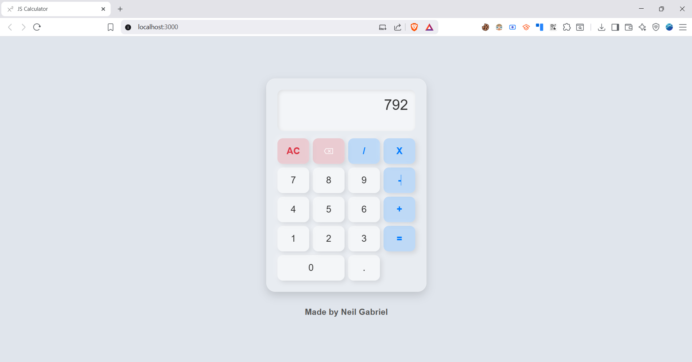

<p align="center">
  <a href="https://js-calculator-six-gray.vercel.app/" target="_blank">
    
  </a>
</p>

<h1 align="center">JS Calculator</h1>

<p align="center">
  <a href="https://js-calculator-six-gray.vercel.app/" target="_blank">Live Demo</a> •
  <a href="#project-description">Project Description</a> •
  <a href="#features">Features</a> •
  <a href="#tech-stack">Tech Stack</a> •
  <a href="#installation">Installation</a> •
  <a href="#usage">Usage</a>
</p>



---

## Project Description

**JS Calculator** is a responsive and interactive web application that allows users to perform basic arithmetic operations.  
Built with **React**, it demonstrates component-based architecture, state management, and clean UI design.

🔗 [Live Demo](https://js-calculator-six-gray.vercel.app/)

---

## Features

- Perform basic arithmetic operations: addition, subtraction, multiplication, division
- Clear (C) and all-clear (AC) functionality
- Responsive layout for desktop and mobile screens
- Interactive button states for a better user experience
- Visual display showing the current input or result

---

## Tech Stack

- **Frontend**: React
- **Deployment**: Vercel

---

## Installation

```bash
git clone https://github.com/nca-gabriel/js-calculator.git
cd js-calculator
npm install


```

---

## Usage

Start the development server:

```bash
npm run dev
```
## Credits
- [Equation icon](https://www.flaticon.com/free-icon/equation_18978291) created by [Freepik](https://www.flaticon.com/authors/freepik) - [Flaticon](https://www.flaticon.com/)

